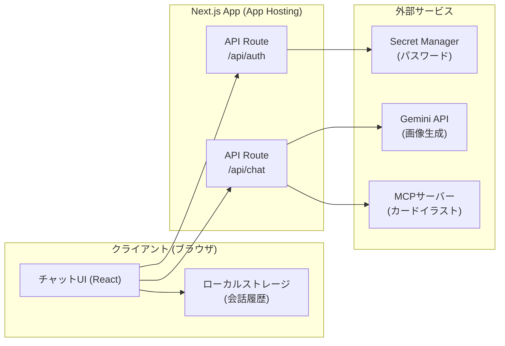
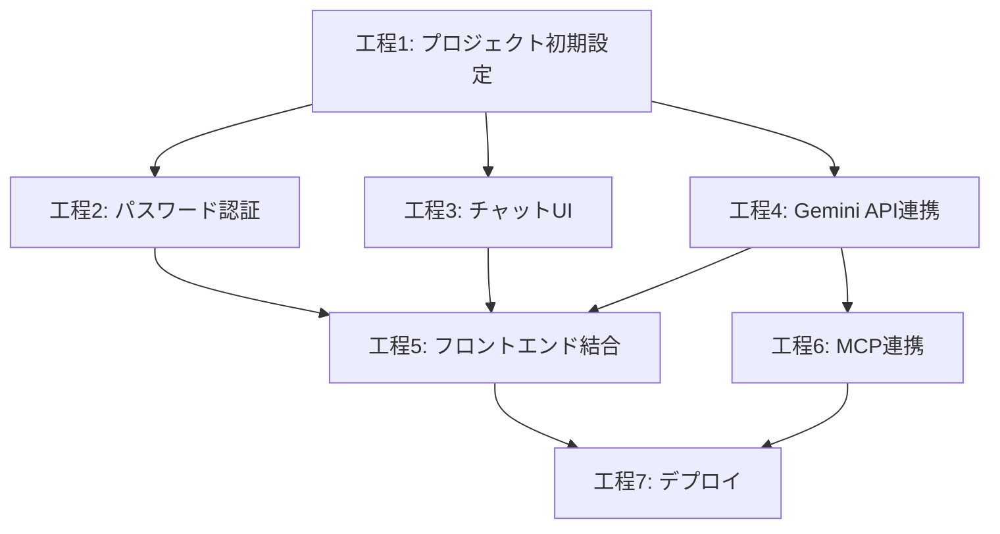

# AL-thumbnail 開発フロー概要

## プロジェクト概要
遊戯王OCGの対戦動画用サムネイル画像を、AIとの対話を通じて生成・修正するWebアプリケーション。

## アーキテクチャ概要

## 技術スタック
| カテゴリ | 技術 |
|---|---|
| フレームワーク | Next.js (App Router / TypeScript) |
| ホスティング | Firebase App Hosting |
| 認証 | 固定パスワード（Secret Manager管理） |
| AI/画像生成 | Gemini API (`gemini-3-pro-image-preview`) |
| 外部連携 | MCPサーバー (SSE接続) |
| セッション管理 | クライアント側 (localStorage / IndexedDB) |

## 作業工程一覧

| # | 工程名 | 概要 | 依存関係 | ドキュメント |
|---|---|---|---|---|
| 1 | プロジェクト初期設定 | Next.js環境構築・Firebase設定 | なし | [01_project_setup.md](./01_project_setup.md) |
| 2 | パスワード認証 | パスワードゲートウェイ実装 | 工程1 | [02_auth_gateway.md](./02_auth_gateway.md) |
| 3 | チャットUI | 対話型UIの実装 | 工程1 | [03_chat_ui.md](./03_chat_ui.md) |
| 4 | Gemini API連携 | マルチターン画像生成API実装 | 工程1 | [04_gemini_integration.md](./04_gemini_integration.md) |
| 5 | フロントエンド結合 | UI + API + セッション管理の結合 | 工程2, 3, 4 | [05_frontend_integration.md](./05_frontend_integration.md) |
| 6 | MCP連携 | MCPサーバーとの接続実装 | 工程4 | [06_mcp_integration.md](./06_mcp_integration.md) |
| 7 | デプロイ | Firebase App Hosting へのデプロイ | 全工程 | [07_deploy.md](./07_deploy.md) |

## 作業フロー図

> [!IMPORTANT]
> **工程2, 3, 4 は並行して進めることが可能です。** 各工程の担当者は独立して作業を開始できます。

## セッション管理方針

会話履歴はサーバー側では保持せず、**クライアントのローカルストレージ（IndexedDB）に保存**します。

- **テキスト履歴**: `localStorage` に JSON 形式で保存
- **画像データ**: サイズが大きいため `IndexedDB` に Blob として保存
- **APIリクエスト時**: クライアントから会話履歴をリクエストボディに含めて送信し、API Route 側で Gemini Chat Session を再構築する
- **ブラウザリロード時**: ローカルの会話履歴から復元可能（ただし完全な再現は保証しない）

> [!WARNING]
> 画像を含む長い会話ではリクエストサイズが大きくなるため、**履歴の上限（例: 直近20ターン）** を設けることを推奨します。
