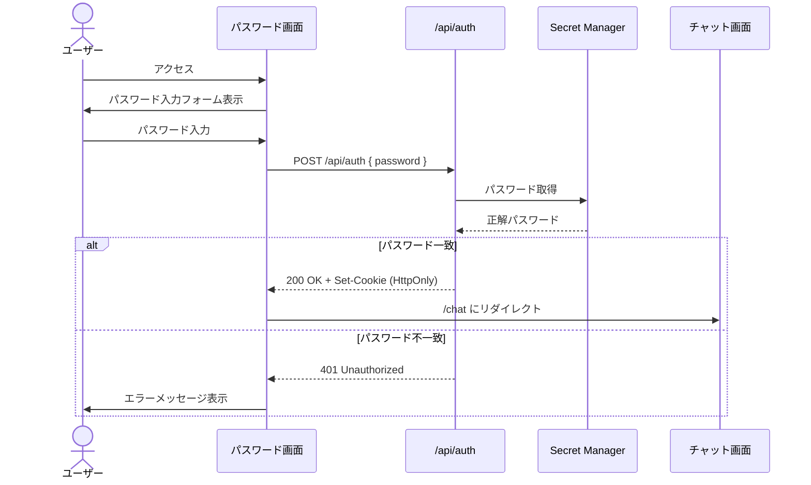

# 工程2: パスワード認証ゲートウェイ

## 目的
アプリケーションへのアクセスを制限するため、固定パスワードによる認証ゲートウェイを実装する。

## 前提条件
- 工程1（プロジェクト初期設定）が完了していること

---

## 設計概要



---

## タスク一覧

### 2-1. Google Cloud Secret Manager の設定

本番環境で使用するパスワードを Secret Manager に登録する。

```bash
# シークレットの作成
gcloud secrets create al-thumbnail-password \
  --project=YOUR_PROJECT_ID

# 値の追加
echo -n "your-password" | gcloud secrets versions add al-thumbnail-password \
  --data-file=- \
  --project=YOUR_PROJECT_ID
```

Firebase App Hosting のサービスアカウントに Secret Manager へのアクセス権限を付与すること。

> [!NOTE]
> ローカル開発時は `.env.local` の `AUTH_PASSWORD` を使用し、本番では Secret Manager から取得する。

### 2-2. パスワード取得ユーティリティの実装

**ファイル:** `src/lib/auth.ts`

```typescript
// 実装すべき関数
export async function getPassword(): Promise<string>
// - 本番: Secret Manager から取得
// - ローカル: process.env.AUTH_PASSWORD から取得

export function verifyPassword(input: string, correct: string): boolean
// - 入力パスワードの検証
```

- `NODE_ENV` や環境変数の有無で Secret Manager とローカル環境変数を切り替える
- Secret Manager へのアクセスには `@google-cloud/secret-manager` パッケージを使用する

```bash
npm install @google-cloud/secret-manager
```

### 2-3. 認証 API Route の実装

**ファイル:** `src/app/api/auth/route.ts`

**エンドポイント:** `POST /api/auth`

| 項目 | 内容 |
|---|---|
| リクエストBody | `{ "password": "string" }` |
| 成功レスポンス | `200 OK`、`Set-Cookie: auth_token=<token>; HttpOnly; Secure; SameSite=Strict; Path=/; Max-Age=86400` |
| 失敗レスポンス | `401 Unauthorized`、`{ "error": "パスワードが正しくありません" }` |

実装ポイント:
- Cookie の `auth_token` にはパスワード自体ではなく、**ハッシュ値やHMAC署名トークン**を格納し、改ざんを防止すること
- Cookie の有効期限は24時間とする
- このトークンは後で MCP サーバーへの `Authorization: Bearer` ヘッダーとしても使用される（工程6で対応）

### 2-4. 認証ミドルウェアの実装

**ファイル:** `src/middleware.ts`

Next.js Middleware を使用し、`/chat` 以下のルートへのアクセスを保護する。

```typescript
// 実装要件
// - /chat および /api/chat へのリクエストに対して、auth_token Cookie を検証する
// - Cookie が無い or 無効 → /（パスワード画面）にリダイレクト
// - / (ルート) および /api/auth はミドルウェアの対象外とする
```

### 2-5. パスワード入力画面の実装

**ファイル:** `src/app/page.tsx`

UI要件:
- 中央配置のパスワード入力フォーム
- ロゴまたはアプリ名「AL-thumbnail」の表示
- パスワード入力フィールド（type=password）
- 送信ボタン
- エラー時のメッセージ表示
- レスポンシブ対応
- 認証成功後、`/chat` にリダイレクト

---

## 完了条件
- [ ] パスワード入力画面が表示される
- [ ] 正しいパスワードでログインすると `/chat` に遷移する
- [ ] 間違ったパスワードではエラーメッセージが表示される
- [ ] Cookie が無い状態で `/chat` にアクセスすると `/` にリダイレクトされる
- [ ] ローカル環境で `.env.local` のパスワードが使用される
