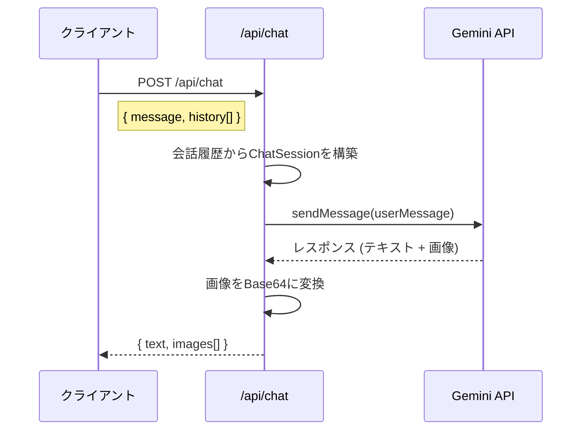

# 工程4: Gemini API 連携

## 目的
Gemini API のマルチターン画像生成機能を利用した API Route を実装する。  
この工程ではバックエンドのAPI実装に集中し、フロントエンドとの結合は工程5で行う。

## 前提条件
- 工程1（プロジェクト初期設定）が完了していること
- Gemini API キーが取得済みであること

---

## 設計概要

### API フロー



### リクエスト/レスポンス仕様

**エンドポイント:** `POST /api/chat`

**リクエストBody:**
```json
{
  "message": "ブルーアイズのサムネイルを作って",
  "history": [
    {
      "role": "user",
      "parts": [{ "text": "こんにちは" }]
    },
    {
      "role": "model",
      "parts": [{ "text": "こんにちは！サムネイルを作りましょう。" }]
    }
  ]
}
```

**レスポンスBody（成功時）:**
```json
{
  "text": "ブルーアイズ・ホワイト・ドラゴンをモチーフにしたサムネイルを作成しました。",
  "images": [
    {
      "mimeType": "image/png",
      "data": "<base64-encoded-image-data>"
    }
  ]
}
```

**レスポンスBody（エラー時）:**
```json
{
  "error": "画像生成に失敗しました",
  "details": "..."
}
```

---

## タスク一覧

### 4-1. Gemini クライアントの初期化

**ファイル:** `src/lib/gemini.ts`

```typescript
import { GoogleGenAI } from "@google/genai";

// 実装すべき内容:
// 1. GoogleGenAI クライアントのシングルトン初期化
// 2. 使用モデル: "gemini-3-pro-image-preview"（もしくは最新の画像生成対応モデル）
// 3. システムプロンプトの定義（要件定義書 3-2 参照）
// 4. Generation Config の定義
```

**システムプロンプト:**
```
あなたは遊戯王OCGの対戦動画サムネイルを作成するアシスタントです。
ユーザーの要望に応じて、必ずMCPツール（get_theme_illustrations または get_card_illustration）を使用して関連する公式カードイラストを参照し、それらを元に画像を生成してください。
```

> [!IMPORTANT]  
> MCP連携が未実装の段階では、MCPツールに関する指示をシステムプロンプトから一時的に除外し、単純な画像生成のみ行うように調整すること。工程6完了後に完全版のプロンプトに切り替える。

**Generation Config:**
```typescript
const generationConfig = {
  responseModalities: ["TEXT", "IMAGE"],
  imageConfig: {
    aspectRatio: "16:9",
    imageSize: "1K",
  },
};
```

### 4-2. Chat API Route の実装

**ファイル:** `src/app/api/chat/route.ts`

実装要件:
1. リクエストボディから `message` と `history` を取得
2. `history` を使って Gemini の `startChat()` を呼び出し、チャットセッションを再構築する
3. `chat.sendMessage()` で新しいメッセージを送信
4. レスポンスからテキストと画像を抽出
5. 画像は Base64 エンコードしてレスポンスに含める
6. エラーハンドリング（API制限、不適切コンテンツブロック等）

```typescript
// 実装の擬似コード
export async function POST(request: Request) {
  // 1. 認証チェック（auth_token Cookie）
  // 2. リクエストボディのパース & バリデーション
  // 3. Gemini Chat Session の構築
  //    const chat = model.startChat({ history: parsedHistory });
  // 4. メッセージ送信
  //    const result = await chat.sendMessage(message);
  // 5. レスポンスのパース（テキスト + 画像の分離）
  // 6. JSON レスポンスの返却
}
```

### 4-3. レスポンスパーサーの実装

**ファイル:** `src/lib/gemini.ts`（または専用ファイル）

Gemini API のレスポンスからテキストパートと画像パートを分離するユーティリティ関数を実装する。

```typescript
// 実装すべき関数
export function parseGeminiResponse(response: GenerateContentResponse): {
  text: string;
  images: { mimeType: string; data: string }[];
}
```

- `response.candidates[0].content.parts` をイテレートし、`text` と `inlineData` を分離する
- 画像データは `inlineData.data`（Base64）と `inlineData.mimeType` を取得

### 4-4. エラーハンドリング

以下のエラーケースに対応すること:

| エラーケース | 対応 |
|---|---|
| API キーが無効 | 500 + 管理者にエラーメッセージ |
| レート制限超過 | 429 + リトライ指示 |
| コンテンツフィルター | 400 + ユーザーへのフィードバック |
| タイムアウト | 504 + リトライ指示 |
| 画像生成非対応 | 400 + モデル変更の提案 |

### 4-5. ローカルでの動作確認

以下の `curl` コマンドで API が動作することを確認する。

```bash
# 新規メッセージ（履歴なし）
curl -X POST http://localhost:3000/api/chat \
  -H "Content-Type: application/json" \
  -H "Cookie: auth_token=your-token" \
  -d '{
    "message": "青い龍のサムネイルを作って",
    "history": []
  }'

# マルチターン（履歴あり）
curl -X POST http://localhost:3000/api/chat \
  -H "Content-Type: application/json" \
  -H "Cookie: auth_token=your-token" \
  -d '{
    "message": "もう少し暗くして",
    "history": [
      { "role": "user", "parts": [{ "text": "青い龍のサムネイルを作って" }] },
      { "role": "model", "parts": [{ "text": "作成しました！" }] }
    ]
  }'
```

---

## 完了条件
- [ ] `POST /api/chat` がテキストと画像を含むレスポンスを返す
- [ ] 会話履歴を送信することでマルチターンの文脈維持が動作する
- [ ] 画像が 16:9 のアスペクト比で生成される
- [ ] エラー時に適切なHTTPステータスコードとメッセージが返る
- [ ] 上記 `curl` コマンドで動作確認ができる
