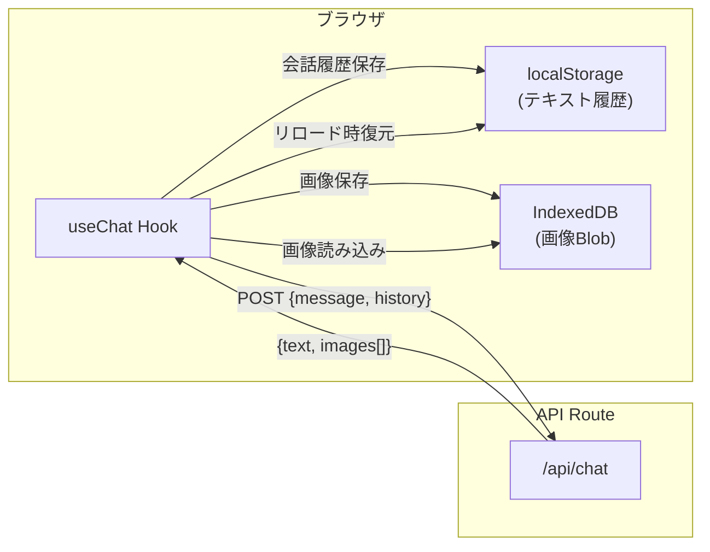

# 工程5: フロントエンド結合

## 目的
工程2（認証）、工程3（チャットUI）、工程4（Gemini API）の成果物を統合し、  
会話履歴のクライアント側管理を含めた、エンドツーエンドで動作するアプリケーションを完成させる。

## 前提条件
- 工程2, 3, 4 がすべて完了していること

---

## 設計概要

### 会話履歴管理アーキテクチャ



---

## タスク一覧

### 5-1. 会話履歴ストアの実装

**ファイル:** `src/stores/chatStore.ts`

IndexedDB を用いた画像ストレージと、localStorage を用いたテキスト履歴の管理ロジックを実装する。

```typescript
// 実装すべきインターフェース

// テキスト履歴の管理 (localStorage)
export function saveHistory(sessionId: string, messages: ChatMessage[]): void;
export function loadHistory(sessionId: string): ChatMessage[] | null;
export function deleteHistory(sessionId: string): void;
export function listSessions(): { id: string; title: string; updatedAt: number }[];

// 画像データの管理 (IndexedDB)
export function saveImage(imageId: string, blob: Blob): Promise<void>;
export function loadImage(imageId: string): Promise<Blob | null>;
export function deleteSessionImages(sessionId: string): Promise<void>;
```

> [!WARNING]
> **履歴サイズの制限**
> - テキスト履歴: 直近 **20ターン（40メッセージ）** を上限とする
> - 画像データ: セッションあたり **50枚** を上限とする
> - 上限を超えた古いデータは自動的に削除する

### 5-2. チャットカスタムフックの実装

**ファイル:** `src/hooks/useChat.ts`

チャットの状態管理と API 通信をカプセル化するカスタムフックを実装する。

```typescript
export function useChat() {
  // 返却すべき値・関数:
  return {
    messages: ChatMessage[],       // 現在の会話メッセージ一覧
    isLoading: boolean,            // API通信中フラグ
    error: string | null,          // エラーメッセージ
    sendMessage: (text: string) => Promise<void>,  // メッセージ送信
    startNewChat: () => void,      // 新規チャット開始
    currentSessionId: string,      // 現在のセッションID
  };
}
```

**`sendMessage` の処理フロー:**
1. ユーザーメッセージを `messages` に追加
2. `isLoading = true` に設定
3. 会話履歴を Gemini API の `history` 形式に変換
4. `POST /api/chat` を呼び出す
5. レスポンスから AI メッセージを構築し `messages` に追加
6. 画像があれば IndexedDB に保存
7. テキスト履歴を localStorage に保存
8. `isLoading = false` に設定

**履歴のフォーマット変換:**
```typescript
// クライアント側の ChatMessage[] → Gemini API の history 形式への変換
function toGeminiHistory(messages: ChatMessage[]): GeminiHistoryEntry[] {
  return messages.map((msg) => ({
    role: msg.role === "user" ? "user" : "model",
    parts: [
      { text: msg.text },
      // 画像がある場合は inlineData として追加
      ...(msg.images?.map((img) => ({
        inlineData: { mimeType: img.mimeType, data: img.data },
      })) ?? []),
    ],
  }));
}
```

> [!IMPORTANT]
> 会話が長くなった場合のリクエストサイズに注意。画像を含む履歴は非常に大きくなる可能性があるため、**直近 N ターン分のみ送信する**仕組みを実装すること。古い画像データは履歴から除外し、テキストのみを残す。

### 5-3. チャット画面への統合

**ファイル:** `src/app/chat/page.tsx`（工程3の成果物を更新）

- モックデータを削除し、`useChat` フックに差し替える
- `sendMessage` をフォーム送信に接続
- `isLoading` 中のローディング表示
- エラー表示の実装

### 5-4. セッション管理UI（任意）

**優先度: 低**

サイドバーやドロップダウンで過去のチャットセッションを一覧・切り替えできるUIを実装する。  
最低限のMVPでは不要だが、利便性のために後で追加できるよう設計段階で考慮しておくこと。

---

## 完了条件
- [ ] テキストメッセージを送信し、AIの応答（テキスト + 画像）が表示される
- [ ] 会話の文脈を維持した修正指示（例:「もう少し暗くして」）が正しく動作する
- [ ] 生成された画像をダウンロードできる
- [ ] ブラウザをリロードしても会話履歴が復元される
- [ ] パスワード未認証の状態では `/chat` にアクセスできない
- [ ] モバイル・デスクトップそれぞれで正常に動作する
