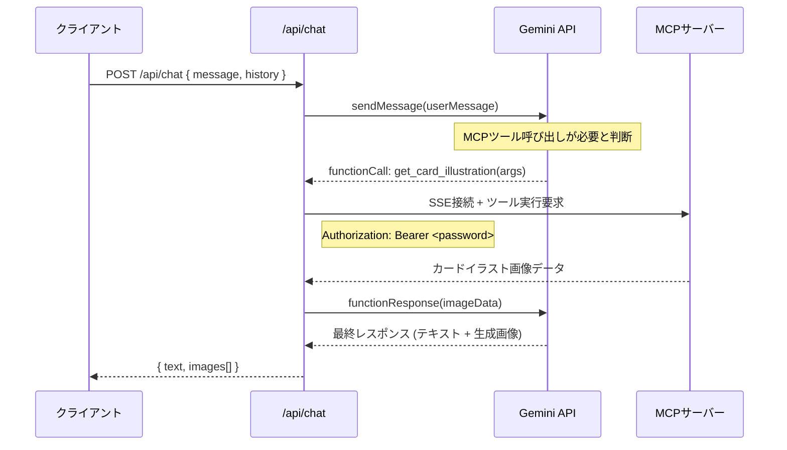

# 工程6: MCP サーバー連携

## 目的
Gemini API が MCP ツール（`get_theme_illustrations`, `get_card_illustration`）を呼び出せるようにし、  
MCPサーバーから取得したカードイラストを画像生成の参照として利用できるようにする。

## 前提条件
- 工程4（Gemini API連携）が完了していること
- MCPサーバーが開発完了し、エンドポイントが利用可能になっていること

> [!IMPORTANT]
> MCPサーバーは別メンバーが開発中です。MCPサーバーのAPI仕様が確定次第、本工程に着手してください。  
> MCP サーバーの仕様が未確定の間は、工程5まで先行して開発を進めてください。

---

## 設計概要

### MCP 通信フロー



### MCPツール定義（想定）

MCPサーバーが提供するツールの仕様（確定次第更新すること）:

#### `get_card_illustration`
| 項目 | 内容 |
|---|---|
| 説明 | 指定カード名のイラストを取得する |
| パラメータ | `{ "card_name": "string" }` |
| 戻り値 | `{ "mimeType": "image/png", "data": "<base64>" }` |

#### `get_theme_illustrations`
| 項目 | 内容 |
|---|---|
| 説明 | テーマ（アーキタイプ）に属するカードイラストを複数取得する |
| パラメータ | `{ "theme": "string", "limit?": "number" }` |
| 戻り値 | `{ "illustrations": [{ "card_name": "string", "mimeType": "image/png", "data": "<base64>" }] }` |

---

## タスク一覧

### 6-1. MCP クライアントの実装

**ファイル:** `src/lib/mcp.ts`

MCPサーバーとの SSE 接続およびツール実行を行うクライアントを実装する。

```typescript
// 実装すべきインターフェース

export class McpClient {
  constructor(serverUrl: string, authToken: string);

  // SSE接続の確立
  async connect(): Promise<void>;

  // ツールの実行
  async executeTool(
    toolName: string,
    args: Record<string, unknown>
  ): Promise<unknown>;

  // 接続の切断
  async disconnect(): Promise<void>;
}
```

- SSE接続時に `Authorization: Bearer <password>` ヘッダーを付与
- 接続エラー時のリトライロジック（最大3回、指数バックオフ）
- タイムアウト: 30秒

### 6-2. Gemini の Function Calling 設定

**ファイル:** `src/lib/gemini.ts`（更新）

Gemini API に MCP ツールを Function Declaration として登録する。

```typescript
const tools = [
  {
    functionDeclarations: [
      {
        name: "get_card_illustration",
        description: "指定されたカード名の公式イラストを取得します",
        parameters: {
          type: "OBJECT",
          properties: {
            card_name: {
              type: "STRING",
              description: "取得したいカードの名前",
            },
          },
          required: ["card_name"],
        },
      },
      {
        name: "get_theme_illustrations",
        description:
          "指定されたテーマ（アーキタイプ）に属するカードのイラストを複数取得します",
        parameters: {
          type: "OBJECT",
          properties: {
            theme: {
              type: "STRING",
              description: "テーマ名（例: ブルーアイズ、ブラック・マジシャン）",
            },
            limit: {
              type: "NUMBER",
              description: "取得するイラストの最大枚数（デフォルト: 5）",
            },
          },
          required: ["theme"],
        },
      },
    ],
  },
];
```

### 6-3. Function Calling ハンドラの実装

**ファイル:** `src/app/api/chat/route.ts`（更新）

Gemini API から Function Call レスポンスが返された場合の処理ループを実装する。

```typescript
// 擬似コード
async function handleChat(message: string, history: History[]) {
  const chat = model.startChat({ history, tools });
  let response = await chat.sendMessage(message);

  // Function Calling ループ
  while (hasFunctionCall(response)) {
    const functionCall = extractFunctionCall(response);

    // MCPサーバーにツール実行を要求
    const mcpClient = new McpClient(MCP_SERVER_URL, authToken);
    const result = await mcpClient.executeTool(
      functionCall.name,
      functionCall.args
    );

    // 結果をGeminiに返す
    response = await chat.sendMessage([
      {
        functionResponse: {
          name: functionCall.name,
          response: result,
        },
      },
    ]);
  }

  return parseGeminiResponse(response);
}
```

### 6-4. システムプロンプトの更新

工程4で一時的に除外していた MCP ツールに関する指示を、システムプロンプトに復元する。

```diff
 あなたは遊戯王OCGの対戦動画サムネイルを作成するアシスタントです。
-ユーザーの要望に応じて画像を生成してください。
+ユーザーの要望に応じて、必ずMCPツール（get_theme_illustrations または get_card_illustration）を使用して関連する公式カードイラストを参照し、それらを元に画像を生成してください。
```

---

## 完了条件
- [ ] Gemini API が自動的に MCP ツールを呼び出し、カードイラストを取得する
- [ ] 取得したイラストを参照して画像が生成される
- [ ] MCPサーバーへの接続に認証トークンが正しく付与される
- [ ] MCPサーバーが応答しない場合のエラーハンドリングが動作する
- [ ] Function Calling の複数回ループ（複数ツール呼び出し）が正しく動作する
